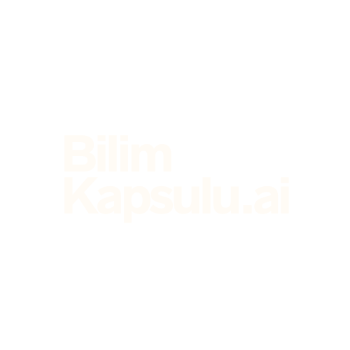

<p align="center">
  
</p>

<h1 align="center">BilimKapsulu.ai 🚀</h1>

<p align="center">
  <strong>Araştırmacıların ve öğrencilerin uluslararası akademik makalelere kendi dillerinde erişmelerini sağlayan yapay zeka destekli bir platform.</strong>
</p>

<p align="center">
  <a href="#özellikler">Özellikler</a> •
  <a href="#teknolojiler">Teknolojiler</a> •
  <a href="#kurulum-ve-çalıştırma">Kurulum</a> •
  <a href="#proje-yapısı">Yapı</a>
</p>

---


## 🌟 Özellikler

### Temel Özellikler
*   **🌍 Çok Dilli Erişim**: İngilizce makaleleri anında Türkçe'ye çevirir.
*   **🧠 AI Destekli Özetleme**: Uzun makaleleri detaylı ve kapsamlı özetlere dönüştürür.
*   **💬 Makale ile Sohbet**: Makale içeriği hakkında yapay zekaya sorular sorun ve anında cevap alın.
*   **🔥 Canlı Akış**: Dünyanın en iyi üniversitelerinden yayınlanan en yeni makaleleri takip edin.
*   **👤 Kişiselleştirilmiş Profil**: İlgi alanlarınıza göre öneriler alın ve ilerlemenizi takip edin.
*   **🔗 Kaynak Bağlantıları**: Makale kartından doğrudan orijinal kaynağa erişin.

### Gelişmiş Özellikler
*   **📴 Çevrimdışı Okuma**: Makaleleri IndexedDB kullanarak cihazınıza kaydedin ve internet olmadan okuyun.
*   **📊 Okuma İstatistikleri**: Okuma sürelerinizi, serileri ve kategori dağılımını grafiklerle görüntüleyin.
*   **⏱️ Akıllı Okuma Takibi**: Gerçek okuma sürenizi arka planda otomatik takip eder (30 sn hareketsizlikte duraklar).

## 🛠️ Teknolojiler

Bu proje aşağıdaki modern teknolojiler kullanılarak geliştirilmiştir:

*   **Frontend**: [React](https://reactjs.org/) (TypeScript), [Vite](https://vitejs.dev/)
*   **Styling**: [Tailwind CSS](https://tailwindcss.com/), [Lucide React](https://lucide.dev/) (İkonlar)
*   **AI & LLM**: [Google Gemini API](https://ai.google.dev/) (Çeviri, Özetleme ve Sohbet için)
*   **Veri Kaynakları**: OpenAlex, arXiv, Semantic Scholar (CORS Proxy ile)
*   **Depolama**: IndexedDB (Çevrimdışı veriler, okuma istatistikleri)
*   **Ses**: Web Speech API (Metinden sese dönüştürme)

## 🚀 Kurulum ve Çalıştırma

Projeyi yerel ortamınızda çalıştırmak için aşağıdaki adımları izleyin.

### Gereksinimler

*   Node.js (v16 veya üzeri)
*   npm veya yarn

### 1. Projeyi Klonlayın

```bash
git clone https://github.com/ezzhamed/bilimkapsulu_ai.git
cd bilimkapsulu_ai
```

### 2. Bağımlılıkları Yükleyin

```bash
npm install
```

### 3. Çevre Değişkenlerini Ayarlayın

Projenin kök dizininde `.env` dosyası oluşturun:

```env
# Google Gemini AI API Anahtarı
VITE_GEMINI_API_KEY=your_gemini_api_key
```

### 4. Uygulamayı Başlatın

```bash
npm run dev
```

Uygulama `http://localhost:3000` adresinde çalışacaktır.


## 📁 Proje Yapısı

```
bilimkapsulu_ai/
├── components/          # UI bileşenleri
│   ├── AnalyticsChart.tsx    # İstatistik grafikleri
│   ├── ChatPanel.tsx         # AI sohbet paneli
│   ├── Header.tsx            # Üst navigasyon
│   └── PaperCard.tsx         # Makale kartları
├── pages/               # Sayfa bileşenleri
│   ├── Home.tsx              # Ana sayfa (Panel, Arama, Kategoriler)
│   ├── PaperView.tsx         # Makale görüntüleme
│   ├── ProfilePage.tsx       # Profil sayfası
│   └── SettingsPage.tsx      # Ayarlar
├── services/            # API ve veri servisleri
│   ├── externalApiService.ts # OpenAlex, arXiv, Semantic Scholar API
│   ├── geminiService.ts      # Gemini AI entegrasyonu
│   ├── offlineStorage.ts     # IndexedDB işlemleri
│   └── mockData.ts           # Örnek veriler
└── types.ts             # TypeScript tip tanımları
```

## 📅 Son Güncelleme

28.12.2024 - Güncel Özellikler